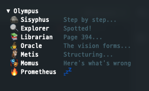

<!-- <CENTERED SECTION FOR GITHUB DISPLAY> -->

<div align="center">

# 🏛️ omo-olympus

**에이전트에게 이름이 있었습니다. 이제 얼굴도 생겼습니다.**

[](https://www.npmjs.com/package/omo-olympus)
[](LICENSE)

[English](README.md) | [한국어](README.ko.md)

</div>

<!-- </CENTERED SECTION FOR GITHUB DISPLAY> -->

<div align="center">
<table>
<tr>
<td align="center" valign="middle">

```
▼ Olympus
 🪨 Sisyphus    Pushing uphill...
 🔍 Explorer    Following a lead...
 📚 Librarian   Cross-referencing...
 🧙 Oracle      💤
 🦉 Metis       💤
 🎭 Momus       💤
 🔥 Prometheus  💤
```

</td>
<td align="center" valign="middle">



</td>
</tr>
</table>
</div>

---

[oh-my-opencode](https://github.com/code-yeongyu/oh-my-openagent)를 쓰고 있다면, 에이전트가 병렬로 실행되고, 백그라운드 태스크가 날아다니고, 세션이 생겼다 사라지는 걸 알고 있을 겁니다.

근데 그게 **안 보입니다.**

omo-olympus가 바꿔줍니다. 7명의 에이전트. 7개의 그리스 신화 페르소나. 사이드바에서 실시간 대사가 흘러갑니다. Explorer가 코드를 뒤지면 — *"I smell a clue"*. Oracle이 깊이 들여다보면 — *"The vision forms..."*. Momus가 계획을 찢으면 — *"Don't shoot the messenger"*.

비활성 에이전트는 💤. 활성 에이전트는 말합니다. 신들이 일하는 걸 지켜보세요.

## 왜 "Olympus"인가?

하루 종일 터미널을 봅니다. 에이전트는 뒤에서 돌아가고, 최종 결과가 나올 때까지 뭐가 일어나는지 모릅니다.

심심하잖아요.

그래서 각 에이전트에 그리스 신화 이름을 붙이고, 역할에 맞는 성격을 입히고, 매번 바뀌는 대사를 넣었습니다. Sisyphus가 바위를 밀어올리는 동안 Oracle이 안개 너머를 들여다보는 걸 한 번 보고 나면 — 조용한 사이드바로는 돌아가기 어렵습니다.

## 판테온

상태 표시가 아닙니다. 캐릭터입니다.

| | Agent | 역할 | 이런 말을 합니다 |
|:---:|---|---|---|
| 🪨 | **Sisyphus** | 멈추지 않는 자 | *"One more push" · "The boulder rolls again" · "Summit reached ✓"* |
| 🔍 | **Explorer** | 코드베이스 탐정 | *"On the trail!" · "Checking every corner" · "Case closed"* |
| 📚 | **Librarian** | 모든 걸 기억하는 자 | *"To the stacks!" · "Page 394..." · "The records confirm"* |
| 🧙 | **Oracle** | 남들이 못 보는 걸 보는 자 | *"You seek guidance?" · "Patience, mortal..." · "The path is clear"* |
| 🦉 | **Metis** | 누구보다 먼저 생각하는 자 | *"Hmm, interesting..." · "Weighing options..." · "Scope defined"* |
| 🎭 | **Momus** | 잔인할 정도로 솔직한 비평가 | *"Alright, roast time" · "Not convinced yet..." · "The truth hurts"* |
| 🔥 | **Prometheus** | 계획을 벼리는 자 | *"Fire in the forge" · "Connecting the dots..." · "Blueprint ready"* |

에이전트당 4개 상태 — **start**, **working**, **done**, **error** — 각각 랜덤 대사가 돌아갑니다. 매번 다른 느낌.

## 설치

터미널에서 실행하세요:

```bash
opencode plugin omo-olympus
```

끝. OpenCode가 패키지에서 서버와 TUI 진입점을 자동으로 감지해서 `opencode.json`과 `tui.json`을 모두 업데이트합니다. opencode를 재시작하면 활성화됩니다.

### 수동 설정

직접 설정하려면 두 config 파일에 플러그인을 추가하세요:

**`~/.config/opencode/opencode.json`**
```json
{
  "plugin": ["omo-olympus"]
}
```

**`~/.config/opencode/tui.json`**
```json
{
  "$schema": "https://opencode.ai/tui.json",
  "plugin": [["omo-olympus", { "enabled": true }]]
}
```

설정 파일 수정 후 opencode를 재시작하세요.

## 작동 방식

플러그인 2개. 공유 큐 1개. 설정 0개.

```
task() → 서버가 에이전트 타입 감지 → 대기열 → TUI가 세션 이벤트에서 수신 → 사이드바가 말한다
메인 세션 → 서버가 시스템 프롬프트 확인 → 모드 파일 → TUI가 상태 이벤트에서 페르소나 전환
```

**서버 플러그인**이 네 가지 인터셉션 포인트를 후킹합니다:
- `tool.execute.before` — `task()` 호출을 가로채서 `subagent_type` 또는 `category`로 에이전트 추론
- `tool.execute.after` — 태스크 완료 시그널 기록
- `command.execute.before` — 모드 전환 명령어 감지 (`/start-work`, `/omc-plan`)
- `experimental.chat.system.transform` — 시스템 프롬프트를 읽어 메인 세션 모드 감지 (Prometheus vs Sisyphus)

**TUI 플러그인**이 `sidebar_content`에 렌더링하고 (사이드바 최상단, order 50), 파일 기반 IPC로 자식 세션을 페르소나에 매핑하고, 리액티브 시그널로 실시간 업데이트합니다.

웹소켓 없음. 공유 메모리 없음. `/tmp`의 JSON 파일 하나와 그걸 통해 대화하는 두 플러그인이 전부입니다.

## 기능

|   | 기능 | 왜 필요한가 |
|:---:|---|---|
| 📂 | **접기/펼치기** | 헤더 클릭으로 토글. 접히면 활성 에이전트 수 표시 |
| 🎨 | **테마 연동** | opencode 테마 색상 자동 반영. RGBA buffer → hex 변환 |
| ⚡ | **실시간** | Solid.js 리액티브 시그널. 에이전트 작업과 동시에 업데이트 |
| 🔇 | **자동 수면** | 완료 3초 후 💤로 복귀 |
| 🔄 | **동시 실행 추적** | 같은 에이전트의 여러 인스턴스를 추적; 전부 끝나야 수면 |
| ❌ | **에러 감지** | 실패 시 에러 대사 표시 (5초간 표시) |
| 🔥 | **모드 전환** | 시스템 프롬프트로 Prometheus(계획) vs Sisyphus(실행) 감지 |
| 🧹 | **세션 정리** | `session.deleted` 핸들러로 메모리 릭 방지 |

## 요구사항

- [opencode](https://opencode.ai) 플러그인 지원 (`@opencode-ai/plugin` >= 1.4.3)
- `task()` 호출 기반 에이전트 오케스트레이션 — e.g., [oh-my-opencode](https://github.com/code-yeongyu/oh-my-openagent)

## 수동 설치

npm 없이 소스 파일을 직접 복사:

```bash
mkdir -p ~/.config/opencode/plugins
cp src/tui.tsx ~/.config/opencode/plugins/omo-olympus.tsx
cp src/server.ts ~/.config/opencode/plugins/omo-olympus-server.ts
```

로컬 경로로 등록:
```jsonc
// opencode.json
{ "plugin": ["./plugins/omo-olympus-server.ts"] }

// tui.json
{ "plugin": [["./plugins/omo-olympus.tsx", { "enabled": true }]] }
```

## 기여

이슈와 PR 환영합니다. 새로운 페르소나 아이디어, 더 나은 대사, 버그 리포트 — [이슈를 열어주세요](https://github.com/akasai/omo-olympus/issues).

로컬 개발:

```bash
git clone https://github.com/akasai/omo-olympus.git
cp src/tui.tsx ~/.config/opencode/plugins/omo-olympus.tsx
cp src/server.ts ~/.config/opencode/plugins/omo-olympus-server.ts
```

**팁:** 심링크를 사용하면 복사 없이 실시간 반영됩니다:
```bash
ln -sf $(pwd)/src/server.ts ~/.config/opencode/plugins/omo-olympus-server.ts
ln -sf $(pwd)/src/tui.tsx ~/.config/opencode/plugins/omo-olympus.tsx
```

수정하고, opencode 재시작하면 바로 확인 가능합니다.

테스트 실행:

```bash
npm test
```

## 알려진 이슈

- `tool.execute.before`는 도구 호출당 2번 발생 — 200ms 윈도우로 중복 제거
- 메인 세션 모드 감지에 `experimental.chat.system.transform` 사용 — 향후 opencode 버전에서 API 변경 가능
- 시스템 프롬프트 키워드 매칭(`"You are Prometheus"`)이 OMC 내부 프롬프트 형식에 의존
- 서버 ↔ TUI 통신은 `/tmp/omo-pending.json`, `/tmp/omo-mode.json` 파일 기반 IPC

## 라이선스

MIT
